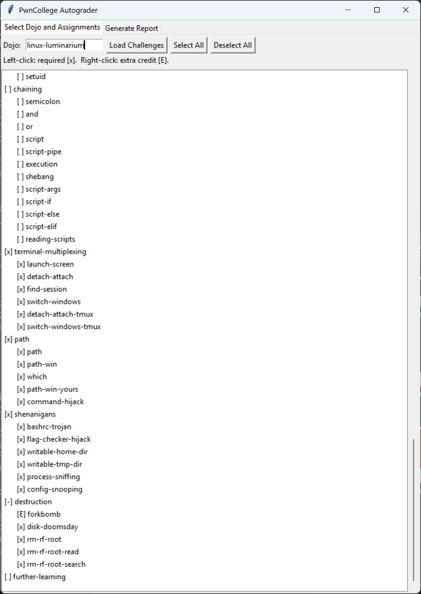
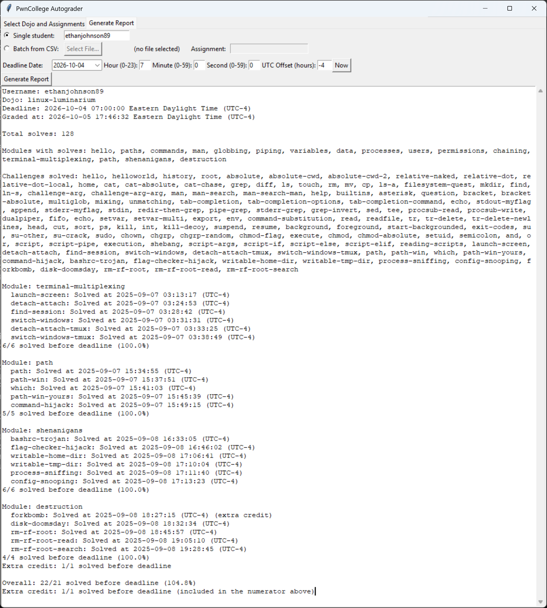

# pwn.college autograder for college courses

**Ethan Johnson**\
**Department of Computer Science, Grove City College**

Several of my cybersecurity and computer systems courses incorporate
materials from the free cybersecurity education platform
[pwn.college](https://pwn.college) as hands-on lab assignments. Since
pwn.college automatically grades and tracks solved levels, most of the hard
work has been done already — but it's not formatted "out of the box" in a
way that's suitable for assigning numeric grades to students. This
autograder automates the process of collecting and tabulating the data so
it's ready to plug into the school's LMS as a numeric grade with feedback
to the student.

I typically create lab assignments by choosing some subset of one of
pwn.college's public modules, and assigning it to my students with a
specific deadline by which they need to complete all the assigned levels.
Partial credit is given linearly by the proportion of assigned levels solved
before the deadline.

The "official" recommended way to use pwn.college in your own course is to
clone the official dojos on GitHub, modify or combine them into a single
dojo for your entire course, and then upload your fork as a private dojo on
pwn.college that students can join with an access code. pwn.college will
then fully automate grading and provide reports to the instructor. However,
while that workflow is powerful, it's more or less designed around the
assumption that you've pre-built your *entire* course around pwn.college
(which is how it's used by its creators at ASU). If you're just
"cherry-picking" like I am, you want to be able to select and adjust labs
"as you go" throughout the semester rather than building it all up front.
I'm not (presently) customizing or remixing any of the challenges, so what
I really wanted was a quick, automated way to collect information on which
levels my students have completed from the existing public dojos.

A "lighter-touch" approach is to use pwn.college's undocumented but
(generally) stable REST API (which was described and recommended to me for
this purpose by the admins on their official Discord server) to download
information from your students' public profiles, which itemizes and
timestamps the levels they've solved. This autograder takes that approach
and packages it up with a (for now) primitive, yet powerful, GUI to support
a rapid grading workflow.

The following workflow and features are currently supported:

- Download a list of all the modules and levels within a dojo and display
  them in the GUI as a hierarchical tree view. You can select or deselect
  individual levels or whole modules at a time to customize your assignment.

- Specify your assignment deadline and provide either a single student's
  username, or a CSV file of students (`LastName,FirstName,Username`), then
  click to generate a detailed grading report for your assignment. Each
  student's report lists the levels that have been assigned and the
  date/time, if any, at which the student solved them. All levels solved
  by the deadline are counted and tabulated for an overall grade.

  - It is assumed that your students have set their profile visibility to
    "public" on pwn.college. If not, you will not be able to access their
    solves. I require my students to do this and provide their usernames to
    me in a shared spreadsheet at the start of the semester.

  - Extra credit levels are supported. These are counted in the numerator
    but not the denominator when calculating the grade, and are broken out
    separately in the report.

  - You can change the time zone used for deadline comparisons, e.g. if a
    daylight savings time change happened between the deadline and when
    you're grading it.

- If you provide an individual student to grade, the student's grade report
  is provided directly in a text box in the GUI. You can then copy/paste
  this into (e.g.) your LMS or an email.

- In CSV batch mode (see above), the entire class is graded at once, and
  the GUI displays progress and each student's grade throughout the run.
  Individual grade reports for students are saved as `.txt` files in a
  folder, with names specifying the student and assignment, for example:

  ```text
  Ronsberg, Jimothy - COMP 448 Lab 3.txt
  ```

  This makes it easy to archive the entire folder for your records, and to
  upload individual feedback to your LMS or send it by email to your
  students. The student's numeric grade is at the bottom of the report in
  the file.

  Since my school's LMS (Brightspace D2L) doesn't have a programmatic API
  that I'm aware of (at least that's accessible to us profs) for
  automatically uploading grades and feedback from a script, this is as far
  as the autograder currently goes. However, the information is easily
  parseable if you want to take it further. Right now, my workflow is to
  feed it to an AI computer-use agent with instructions to drive a GUI web
  browser to copy and paste it all into Brightspace. That's perhaps like
  using a semi-truck to drop off letters, but it works surprisingly well
  (and will only get smoother and faster in the future as AI improves). 🤷‍♂️
  Of course, if you're going to do that, you should make sure you're using
  an AI provider or plan that can guarantee your grading data won't be used
  to train models or retained out of your control. 🤔

## Usage

Just `pip install` the required dependencies from `requirements.txt` (not
too many at the moment), then you can run `autograder.pyw` with `python` or
(this at least works on Windows) by double-clicking the `.pyw` file. The
GUI is hopefully self-explanatory if you're familiar with pwn.college (see
screenshots below).

**Note:** the dojo, module, and level names shown in the GUI and grading
reports are the "raw" ones used internally as keys by pwn.college, not the
"display names" with e.g. capitalization and spaces. (I'm not presently
aware of a way to fetch the display names through the API.) Some of them
are more self-explanatory than others; you can confirm them by looking at
the URLs on pwn.college. In particular, note that the "Playing with
Programs" dojo is non-intuitively called `fundamentals` behind the scenes.

## Screenshots

### Level selection

[](screenshots/level-selection.png)

### Grading report

[](screenshots/grading-report.png)

## Authorship and licensing

© 2025–26 Ethan Johnson

Freely licensed under [0BSD](LICENSE.txt) (see `LICENSE.txt`). Most of the
heavy lifting on this code was done by AI; I'm not particularly concerned
with credit or attribution (although if you find it useful for your own
purposes, I'd love to hear from you!).

Design and code review was by me, with most of the actual coding done by
various AI agents:

- Original 2025 version (pre CSV batch functionality) made with VS Code's
  GitHub Copilot agent (educator free plan), mostly with the Claude 4/4.5
  Sonnet and Grok Code Fast 1 models.

- Subsequent modifications to date (2026-10-05 writing) made with the Grok
  Build CLI agent (Grok 4.6 and 4.7 models).

I wouldn't quite call it "vibe coded" since I'm a stickler about reading
(or at least skimming) all the agents' diffs 😉, but the Tkinter GUI code in
particular is all the AI's work (with design direction from me).

Comments and questions are welcome. However, please be aware that I don't
have a lot of free time to be a "maintainer" of a public codebase. If you
make any fixes or improvements, I'll consider accepting a PR, but I might
have to say no if it would be too "out of scope" for my own classes'
workflow (especially if maintaining it would require me to test for
regressions on use cases I don't myself use). That's what forks are good
for! 🙂
